# 配置环境变量

在这一部分呢，我会带着大家从下载到安装再到配置环境，一步一步处理。

参考网址:https://www.java.com/zh-CN/download/help/whatis_java.html

下载安装JDK的注意事项.

1. 先卸载旧的JDK版本(参考上面网址)

2. 下载JDK时,匹配计算机的操作系统以及位数.

   比如: windows10的64位操作系统,下载时需要匹配对应的64位的JDK版本.

## 下载JDK

在安装 JDK 之前，首先要到 Oracle 网站获取 JDK 安装包。JDK 安装包被集成在 Java SE 中，因此下载 Java SE 即可，具体步骤如下。

(1) 在浏览器中输入 www.oracle.com，打开 Oracle 公司的官方网站。在首页的栏目中选择 如图 1 所示。

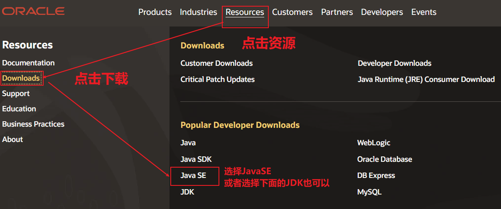

(2)由于 Java 版本不断更新，当读者浏览 JavaSE 的下载页面时，显示的是当前最新的版本,如图二

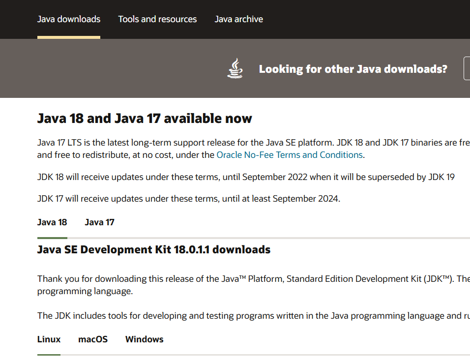

**由于最新版本不稳定,我们倾向于使用较低且稳定的版本,比如: 8, 或者11等版本**

(3) 在当前下载页面, 鼠标滚轮向下滑动,会发现较低版本8和11,如图三

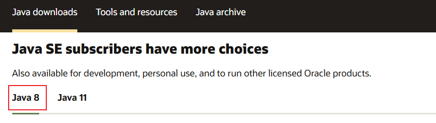

**接下来,选择与自己系统匹配的安装包.**

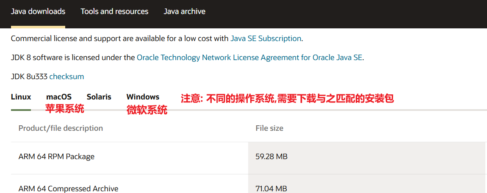

**比如 windows的64位操作系统,如图四:**

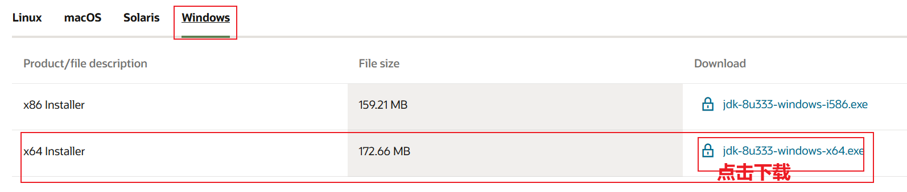

**在弹出窗中,完成下载,如图五:**

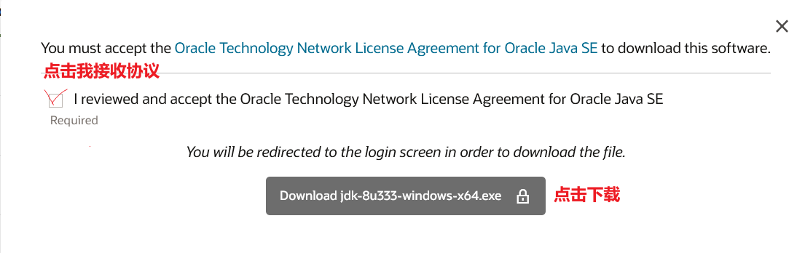

下载完成后, 电脑里面就会有一个jdk-8u333-windows-x64.exe可执行文件.

#### 注意事项：

点击下载后,如果没有Oracle账号,需要先行注册一个账号,使用此账号登录后才能下载,注册账号的操作与其他网站类似,就不赘述了.

## 安装JDK

(1) 双击jdk-8u333-windows-x64.exe可执行文件,会出现如下图:

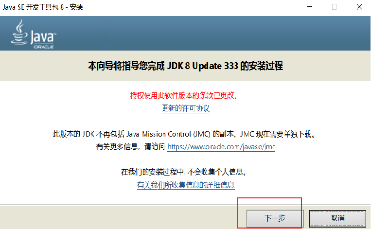

(2) 单击“下一步”按钮，打开定制安装对话框。选择安装的 JDK 组件，如图  所示。

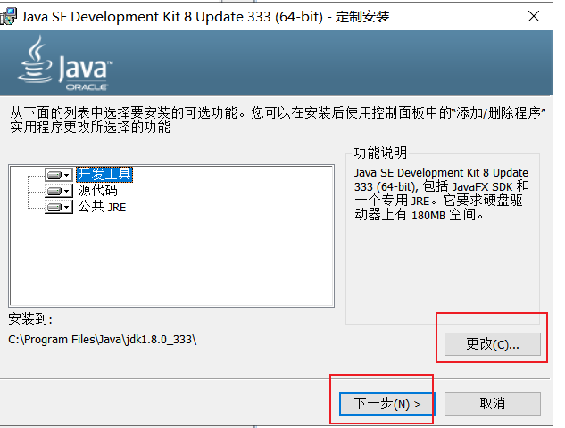

 注意: 如果单击更改路径,需要保证路径不能有中文以及特殊符号等,一般不需要更改,默认就可以了.

(3 )单击“下一步”按钮，打开安装进度界面，如图 所示。

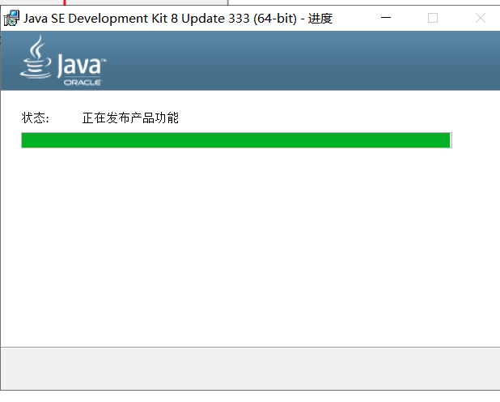

(4)在安装过程中会显示如下图, 所示的目标文件夹对话框，选择 jre 的安装路径，这里使用默认值

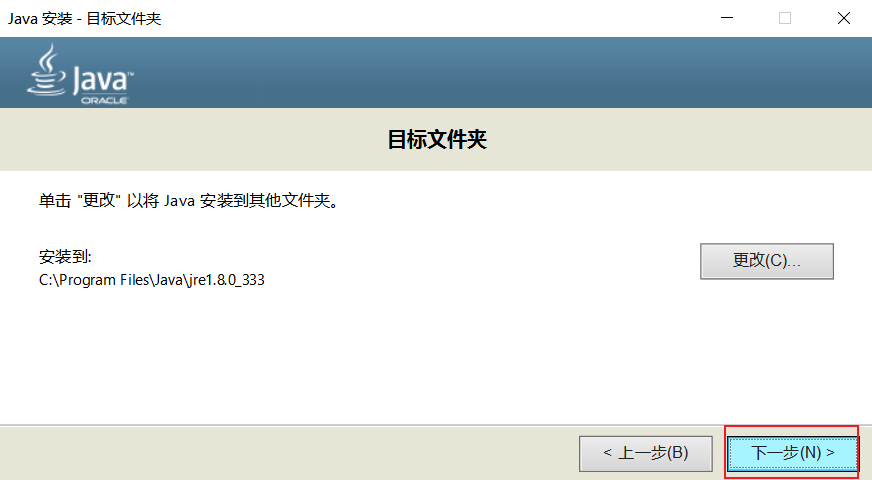

(5)单击“下一步”按钮，安装 JRE。当 JRE 安装完成之后，将打开 JDK 安装完成界面，如下图 所示,点击关闭即可。

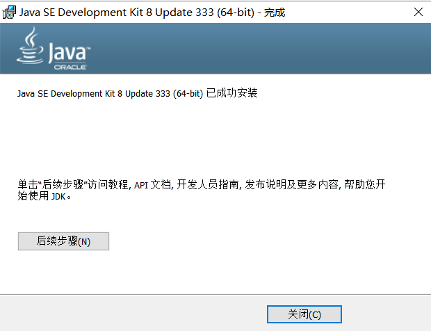

安装完成后，在安装位置打开 JDK 的文件夹，内容和目录结构如下图 所示。

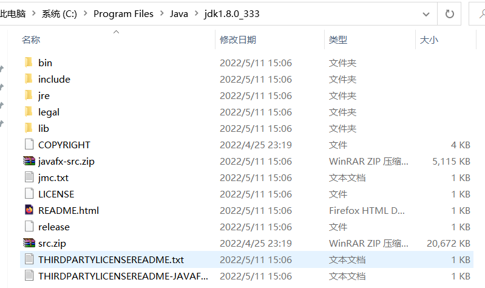

从上图可以看出，JDK 安装目录下具有多个子目录和一些网页文件，其中重要目录和文件的说明如下。

- `bin`：提供 JDK 工具程序，包括 javac、java、javadoc、appletviewer 等可执行程序。

- `include`：存放用于本地访问的文件。

- `jre`：存放 Java 运行环境文件。

  JDK： java的开发环境，是整个java开发 的核心，需要安装JDK

  JRE:   java的运行环境，用来编译和运行java程序的。

  JVM: 虚拟机作用： 编译诶运行java程序的，

- `lib`：存放 Java 的类库文件，工具程序实际上使用的是 Java 类库。JDK 中的工具程序，大多也由 Java 编写而成。

- `src.zip`：Java 提供的 API 类的源代码压缩文件。如果需要查看 API 的某些功能是如何实现的，可以査看这个文件中的源代码内容。

- JDK包含的内容，以及JDK和JRE和JVM区别和联系，如图

  总结： JDK开发环境里面包含来JRE运行环境，JRE运行环境里面包含来JVM

  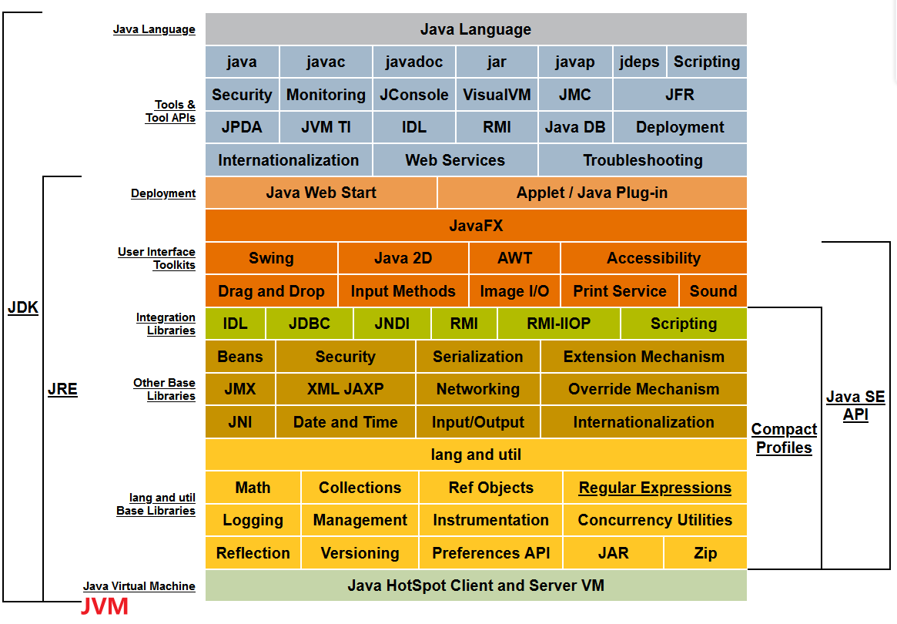

## 配置环境变量

(0) 安裝成功以后，需要配置JDK环境变量

   第一点： 写完java程序后，需要运行环境， 根据配置环境变量快速找到JDK

   第二点： 有些与java语言相关的软件运行需要配置环境变量

  总结: 配置环境变量的目的,就是为了我们在使用过程中,可以直接从操作系统中找到安装的JDK

  比如: 搞养殖,养奶牛, 买奶牛回来, 为了挤牛奶,如果买了好几头奶牛,为了区分需要在奶牛上标记编号(为了区别以及快速找到对应的奶牛).

(1) 从桌面上找到计算机”图标，右键“我的电脑”→“属性”→“高级系统设置”,

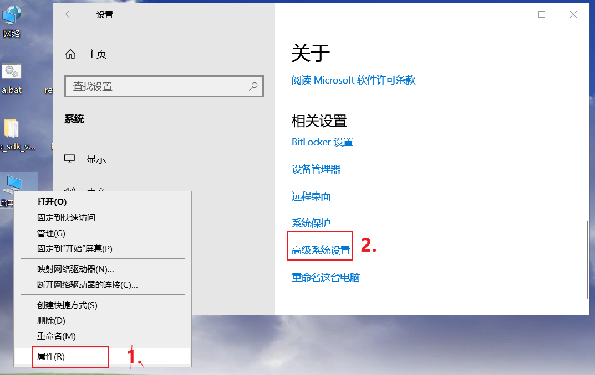

(2) 在弹出的窗口中, 单击“高级”→“环境变量”,

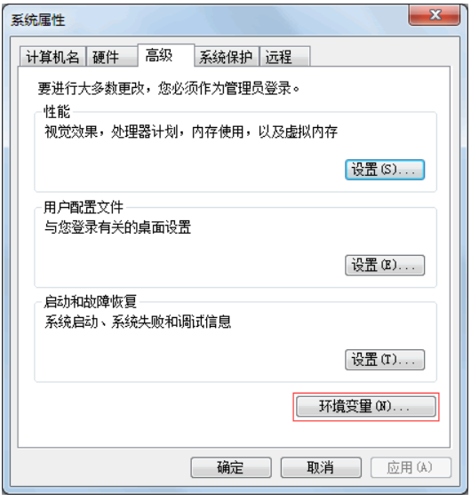

(3) 从弹出的“环境变量”对话框中单击“系统变量”列表框下方的“新建”按钮，如下图所示:

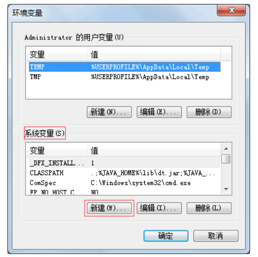

(4)此时会弹出“新建系统变量”对话框。在“变量名”文本框中输入 **JAVA_HOME**，在“变量值”文本框中输入 JDK 的安装路径，如下图所示。最后单击“确定”按钮，保存 **JAVA_HOME** 变量。

 变量名：**JAVA_HOME**
 变量值：C:\Program Files\Java\jdk1.8.0_333 (默认安装的JDK根目录)

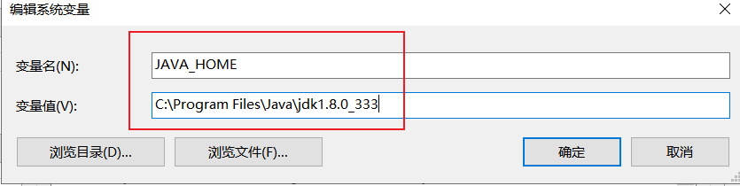

~

(5)在步骤3的所示的“系统变量”列表框中双击 Path 变量，进入“编辑系统变量”对话框。在“变量值”文本框的最前端添加`.;％JAVA__HOME%\bin;`内容，如下图 所示。最后单击“确定”按钮。

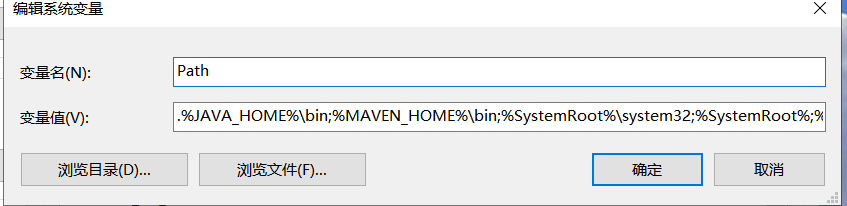

提示：字符串“`.;％JAVA_HOME%\bin;`”中的两个分号是不可缺少的，它们用于分隔多个环境变量。第一个分号前是一个英文状态半角下的句号，表示命令行下的当前目录；第二个分号前则是 JDK 的 bin 目录。

(6)JDK 安装和配置完成后，可以测试其是否能够正常运行。按住win+r 键盘，在打开的“运行”对话框中输入 cmd 命令，按 Enter 键进入到 DOS 环境下。

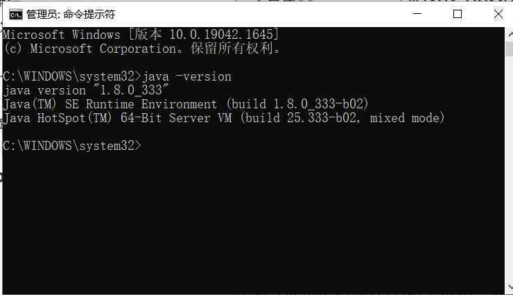

在命令提示符后输入并执行`java -version`命令，系统如果输出类似下图 所示的 JDK 版本信息，说明 JDK 已经配置成功。

提示：在命令提示符后输入测试命令时,需要注意 java 和减号之间有一个空格，而减号和 version 之间没有空格。

 如果没有出现 所示内容，说明 JDK 没有安装成功。另外，一些 [Java](http://c.biancheng.net/java/) 程序会通过环境变量搜索 JDK 的路径，使用压缩包安装 JDK 的方式也需要配置环境变量。

#### 注意事项：

可能存在系统与本示例不一致的情况,不同系统请自行百度”如何打开和配置环境变量”,打开环境变量后有上下两个,我们配置的下面的”系统变量”,此配置对本机的所有用户账户生效, 一台设备可以安装多个JDK,但需要配置环境变量指定让哪个JDK生效,且只能指定一个JDK.