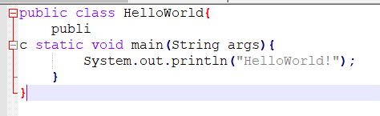

# 1.java基础

## 1.notepad++

一款轻量记事本软件，支持所有主流编程语言，可高亮编程语法。

我们可以看到对一些关键字进行了高亮提示。

## 2.key words 关键字

由Java语言已经定义好的具有特殊意义，运用在特殊位置的词语，开发者不能随意使用。

java中的一些关键字是不能充当标识符来用的:public(公开的) private(私有的)

protected(受保护的) static(静态) 还有一些类型关键字等等

## 3.data type 数据类型

基本类型：

4个整型：

- byte
- short
- int
- long

2个浮点型

- float
- double

1个字符型

- char

1个布尔型

- boolean

**级别从低到高为：**byte,char,short(这三个平级)-->int-->float-->long-->double 

**自动类型转换：**从低级别到高级别，系统自动转的； 

**强制类型转换：**什么情况下使用?把一个高级别的数赋给一个别该数的级别低的变量； 

**注意**  高级别的类型转换为低级别的类型时 容易发生精度丢失。

引用数据类型(数组，对象，枚举等等)

## 4.identifier 标识符

其实就是在程序中自定义的名词。比如类名，变量名，函数名。包含 0-9、a-z、$、_ ；

​    注意：

​    **1），数字不可以开头**

​    **2），不可以使用关键字。**

## 5.package 包

就是目录，通常用多个目录建包，用来区分同名的类。

目录必须小写，切各级目录用  .   隔开

## 6.exegesis 注释

对代码或程序的解释说明，不参与代码或程序运行。
在cmd中运行 javadoc  *.java 生成帮助文档时，只会显示文档注释。

## 7.constant 常量

在程序运行时，不可以被改变的数据，被final关键字修饰。
final 数据类型 常量名 = 数据;

## 8.variable 变量

成员变量即使不赋值也有初始值为0，
局部变量不赋值就没有初始值。

其实就是内存中的一个存储空间，用于存储常量数据。

​    作用：方便于运算。因为有些数据不确定。所以确定该数据的名词和存储空间。

​    特点：变量空间可以重复使用。

**什么时候定义变量？**只要是数据不确定的时候，就定义变量。 

这里涉及到什么是成员变量，什么是局部变量，在后面面向对象时，会再细讲。

**变量空间的开辟需要什么要素呢？**

​    1，这个空间要存储什么数据？数据类型。

​    2，这个空间叫什么名字啊？变量名称。

​    3，这个空间的第一次的数据是什么？ 变量的初始化值。

## 9.运算符号

 1）、算术运算符。

​        + - * / %   **%:**任何整数模2不是0就是1，所以只要改变被模数就可以实现开关运算。

​        +:连接符。

​        ++,--

​    2）、赋值运算符。

​        =  += -= *= /= %=

​    3）、比较运算符。

​        特点：该运算符的特点是：运算完的结果，要么是true，要么是false。

​    4）、逻辑运算符。

​        &  |  ^  !   &&   ||

​        逻辑运算符除了 !  外都是用于连接两个boolean类型表达式。

​        &: 只有两边都为true结果是true。否则就是false。

​        |:只要两边都为false结果是false，否则就是true

​        ^:异或：和或有点不一样。

​             两边结果一样，就为false。

​             两边结果不一样，就为true.

​        **&** **和 &&区别：** & ：无论左边结果是什么，右边都参与运算。

​                      **&&:短路与**，如果左边为false，那么右边不参数与运算。

​        **|** **和|| 区别：**|：两边都运算。

​                    **||：短路或**，如果左边为true，那么右边不参与运算。

​    5）、位运算符:用于操作二进制位的运算符。

​        &  |  ^

​        <<  >>   >>>(无符号右移)

​    **练习：对两个变量的数据进行互换。不需要第三方变量。**

​            int a  = 3,b = 5;-->b = 3,a = 5;

​            a = a + b; a = 8;

​            b = a - b; b = 3;

​            a = a - b; a = 5;

​            a = a ^ b;//

​            b = a ^ b;//b = a ^ b ^ b = a

​            a = a ^ b;//a = a ^ b ^ a = b;

​        练习：高效的算出 2*8 = 2<<3;